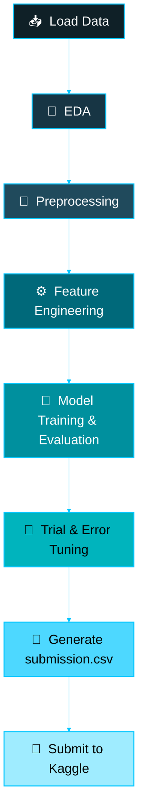
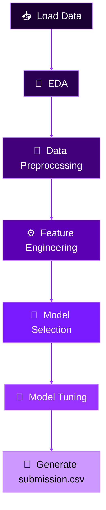

 

 

## 📌 Repository Overview

This repository is a collection of two **Kaggle "Getting Started" competition** solutions, each built as a complete, self-contained ML pipeline — from raw data to a submitted `submission.csv`. Both notebooks follow a consistent, disciplined workflow: explore the data first, engineer features that actually matter, benchmark multiple models honestly, and only then tune the winner.

| # | Project | Task Type | Kaggle Leaderboard Rank |
|:-:|:--|:--|:-:|
| 1 | 🌪️ [Disaster Tweets Classification](#-1-disaster-tweets-classification) | Binary NLP Classification | 🏅 **628** |
| 2 | 🚀 [Spaceship Titanic Prediction](#-2-spaceship-titanic-prediction) | Binary Tabular Classification | 🏅 **1733** |

`🧮 16,306 training records analyzed`  •  `🤖 9 models benchmarked`  •  `🔬 2 GridSearchCV tuning runs`  •  `🎯 2 leaderboard submissions`

 

## 🌪️ 1. Disaster Tweets Classification

**Goal:** Given a tweet, predict whether it is describing a real disaster (`target = 1`) or not (`target = 0`) — a classic NLP text-classification problem on the [Kaggle "Natural Language Processing with Disaster Tweets"](https://www.kaggle.com/competitions/nlp-getting-started) dataset (7,613 training tweets, 3,263 test tweets).

### 🔁 Notebook Workflow

 

## 🚀 2. Spaceship Titanic Prediction

**Goal:** Predict whether a passenger aboard the *Spaceship Titanic* was transported to an alternate dimension after the ship's collision with a spacetime anomaly — a tabular binary classification problem on the [Kaggle Spaceship Titanic](https://www.kaggle.com/competitions/spaceship-titanic) dataset (8,693 training passengers).

### 🔁 Notebook Workflow

 

*"Every leaderboard rank starts with a messy `train.csv` and a stubborn refusal to skip the EDA."* 🚀

