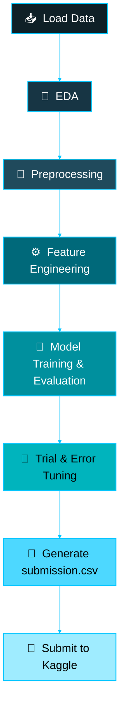
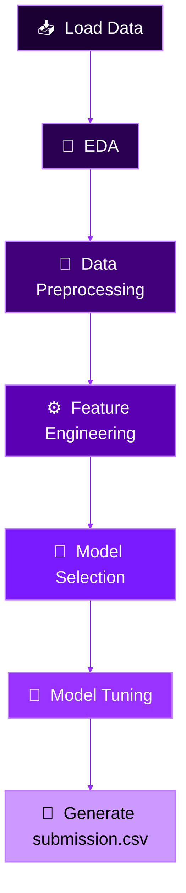

<div align="center">


<a href="https://github.com/Pranamchand">
  
</a>

<br/>


</div>

<br/>

## 📌 Repository Overview

This repository is a collection of two **Kaggle "Getting Started" competition** solutions, each built as a complete, self-contained ML pipeline — from raw data to a submitted `submission.csv`. Both notebooks follow a consistent, disciplined workflow: explore the data first, engineer features that actually matter, benchmark multiple models honestly, and only then tune the winner.

<div align="center">

| # | Project | Task Type | Kaggle Leaderboard Rank |
|:-:|:--|:--|:-:|
| 1 | 🌪️ [Disaster Tweets Classification](#-1-disaster-tweets-classification) | Binary NLP Classification | 🏅 **628** |
| 2 | 🚀 [Spaceship Titanic Prediction](#-2-spaceship-titanic-prediction) | Binary Tabular Classification | 🏅 **1733** |

</div>

<div align="center">

`🧮 16,306 training records analyzed`  •  `🤖 9 models benchmarked`  •  `🔬 2 GridSearchCV tuning runs`  •  `🎯 2 leaderboard submissions`

</div>


<br/>

## 🌪️ 1. Disaster Tweets Classification

<div align="center">


</div>

**Goal:** Given a tweet, predict whether it is describing a real disaster (`target = 1`) or not (`target = 0`) — a classic NLP text-classification problem on the [Kaggle "Natural Language Processing with Disaster Tweets"](https://www.kaggle.com/competitions/nlp-getting-started) dataset (7,613 training tweets, 3,263 test tweets).

### 🔁 Notebook Workflow



### 🔎 Exploratory Data Analysis

The EDA phase digs into class balance, tweet length, keyword-level disaster rates, and location noise before any modeling begins:

```python
# --- Count of Target ---
ax = sns.histplot(data=train, x='target', bins=2)
for i in ax.containers:
    ax.bar_label(i)
plt.title("Value")
plt.show()

# --- Top 20 Keywords by Disaster Rate ---
keyword_rate = (train.groupby("keyword")["target"].mean().sort_values(ascending=False))
keyword_rate.head(20).sort_values().plot(kind="barh")
plt.xlabel("Disaster Rate")
plt.title("Top 20 Keywords")
```

**Key findings:**
- The dataset is fairly balanced — ~43% of tweets are true disaster reports.
- Non-disaster tweets tend to run *longer* than genuine disaster tweets.
- `location` is 33% missing and extremely noisy (free-text field), while `keyword` is only ~0.8% missing.

A smart trick was used to **recover missing locations** by scanning the tweet text itself for any known location string:

```python
def add_location(raw):
    if pd.notna(raw['location']):
        return raw['location']
    text = str(raw['text']).lower()
    for loc in unique_locations:
        if str(loc).lower() in text:
            return loc
    return raw['location']

train["location"] = train.apply(add_location, axis=1)
test["location"] = test.apply(add_location, axis=1)
```

### 🧹 Text Preprocessing

Standard NLP cleaning — lowercasing, URL stripping, punctuation/digit removal, stopword removal, and stemming with `PorterStemmer`:

```python
def text_cleaning(raw):
    raw["clean_text"] = raw["text"].str.lower()
    raw["clean_text"] = raw["clean_text"].apply(
        lambda x: re.sub(r"http\S+|www\S+|https\S+", "", x)
    )
    raw["clean_text"] = raw["clean_text"].str.replace(r"[^\w\s]", "", regex=True)
    raw["clean_text"] = raw["clean_text"].str.replace(r"\d+", "", regex=True)
    raw["clean_text"] = raw["clean_text"].str.strip()
```

### ⚙️ Feature Engineering — 4 Text Variants

Four different text representations were engineered and benchmarked side-by-side to see what actually helps the model:

```python
train['text_only']              = train['clean_text'].copy()
train['text_keyword']           = train['clean_text'] + " " + train['keyword']
train['text_location']          = train['location'] + " " + train['clean_text']
train['text_keyword_location']  = train['keyword'] + " " + train['location'] + " " + train['clean_text']
```

Each variant was vectorized with **TF-IDF** (`max_features=7000`, uni+bigrams) and fed into five candidate models: Logistic Regression, Linear SVC, Multinomial Naive Bayes, Random Forest, and XGBoost.

### 🤖 Model Benchmark

<div align="center">

| Text Variant | Best Model | Accuracy | Precision | Recall | F1 |
|:--|:--|:-:|:-:|:-:|:-:|
| **`text_only`** | **Logistic Regression** | **0.8155** | **0.8373** | **0.7080** | **0.7672** |
| `text_only` | Linear SVC | 0.7873 | 0.7696 | 0.7202 | 0.7441 |
| `text_keyword` | Linear SVC | 0.5292 | 0.4308 | 0.2997 | 0.3535 |
| `text_location` | Linear SVC | 0.5233 | 0.4333 | 0.3578 | 0.3920 |
| `text_keyword_location` | Linear SVC | 0.5358 | 0.4545 | 0.4052 | 0.4285 |

</div>

> Interestingly, injecting `keyword` and `location` into the text **hurt** performance rather than helping — the raw tweet text alone (`text_only`) with Logistic Regression came out on top.

### 🎯 Hyperparameter Tuning

```python
param_grid = {
    "C": [1, 10, 100],
    "solver": ["liblinear", "lbfgs", "saga"],
    "penalty": ["l2", 'deprecated'],
    "class_weight": [None, "balanced"]
}

grid = GridSearchCV(estimator=lr, param_grid=param_grid, scoring="f1", cv=5, n_jobs=-1, verbose=2)
grid.fit(x_train_vec, y_train)
```

GridSearchCV found `{'C': 1, 'class_weight': 'balanced', 'penalty': 'l2', 'solver': 'liblinear'}` with a CV F1 of `0.7434` — slightly **below** the untouched baseline model (F1 `0.7672`), so the original, simpler Logistic Regression was kept as the final model.

### 📄 Final Submission

```python
X_test_vec = vectorizer.transform(test["text_only"])
predictions = lr.predict(X_test_vec)

submission = pd.DataFrame({"id": test["id"], "target": predictions})
submission.to_csv("submission.csv", index=False)
```


<br/>

## 🚀 2. Spaceship Titanic Prediction

<div align="center">


</div>

**Goal:** Predict whether a passenger aboard the *Spaceship Titanic* was transported to an alternate dimension after the ship's collision with a spacetime anomaly — a tabular binary classification problem on the [Kaggle Spaceship Titanic](https://www.kaggle.com/competitions/spaceship-titanic) dataset (8,693 training passengers).

### 🔁 Notebook Workflow



### 🔎 Exploratory Data Analysis

EDA focused heavily on understanding composite fields (`PassengerId`, `Cabin`, `Name`) and spotting behavioral signals like CryoSleep and luxury-spend patterns:

```python
# Distribution of Transported Passengers
ax = sns.countplot(data=train, x='Transported', color='black')
for i in ax.containers:
    ax.bar_label(i)
plt.show()

# Correlation heatmap
plt.figure(figsize=(10, 10))
sns.heatmap(train.corr(numeric_only=True), annot=True)
```

**Key findings:**
- `CryoSleep`, `RoomService`, and `Spa` spend showed the strongest correlation with `Transported`.
- Most victims by age group were children and infants — with 178 passengers listed at exactly Age = 0.
- Luxury services (`FoodCourt`, `ShoppingMall`, `Spa`, `VRDeck`) are heavily right-skewed — enjoyed by only a small subset of passengers.

### 🧹 Preprocessing — Decoding Composite Columns

`PassengerId` and `Cabin` are packed strings (`gggg_pp` and `deck/num/side`) that were unpacked into usable features:

```python
# Break down PassengerId → travel group
train['group'] = train['PassengerId'].str.split('_').str[0]

# Break down Cabin → deck / number / side
train[['deck', 'num', 'side']] = train['Cabin'].str.split('/', expand=True)

# Break down Name → surname, to link family members
train[['Main_name', 'Ser_Name']] = train['Name'].str.split(' ', expand=True)
```

Missing cabin info was intelligently backfilled using the passenger's **surname group** (family members tend to share a cabin):

```python
for col in ['deck', 'num', 'side']:
    filled = train.groupby('Ser_Name')[col].transform(
        lambda x: x.fillna(x.mode().iloc[0]) if not x.mode().empty else x
    )
    train[col] = train[col].where(train[col].notna(), filled)
```

### ⚙️ Feature Engineering

```python
# Group size as a behavioral feature
train['group_size'] = train.groupby('group')['group'].transform('count')

cat_cols  = ['HomePlanet', 'Destination', 'deck', 'side']
num_cols  = ['Age', 'RoomService', 'FoodCourt', 'ShoppingMall', 'Spa', 'VRDeck', 'group_size']
bool_cols = ['CryoSleep', 'VIP']

# Standard Scaling on numeric columns, One-Hot Encoding on categorical columns
scaler = StandardScaler()
train[num_cols] = scaler.fit_transform(train[num_cols])
```

### 🤖 Model Benchmark

<div align="center">

| Model | Accuracy | Precision | Recall | F1 |
|:--|:-:|:-:|:-:|:-:|
| Random Forest | 0.8062 | 0.8267 | 0.7785 | 0.8019 |
| **XGBoost** | **0.8097** | **0.8100** | **0.8128** | **0.8114** |
| Logistic Regression | 0.7918 | 0.7875 | 0.8037 | 0.7955 |
| SVM (RBF Kernel) | 0.7953 | 0.7989 | 0.7934 | 0.7961 |

</div>

> Every model landed within a hair of each other, so the deciding factor came down to **GridSearchCV** fine-tuning.

### 🎯 Hyperparameter Tuning

```python
# XGBoost tuning
xgb = XGBClassifier(random_state=42)
param_grid = {
    'n_estimators': [100, 200],
    'learning_rate': [0.05, 0.1],
    'max_depth': [4, 6, 3],
    'subsample': [0.8, 1.0]
}
grid = GridSearchCV(estimator=xgb, param_grid=param_grid, scoring='accuracy', cv=5, n_jobs=-1, verbose=2)
grid.fit(X_train, y_train)
# Best Parameters: {'learning_rate': 0.05, 'max_depth': 6, 'n_estimators': 100, 'subsample': 0.8}
# Validation Accuracy: 0.8068
```

The tuned **`best_xgb`** model was selected as the final estimator for submission.

### 📄 Final Submission

```python
X = test.drop(columns=['PassengerId'])
predictions = best_xgb.predict(X)

submission = pd.DataFrame({
    "PassengerId": test["PassengerId"],
    "Transported": predictions.astype(bool)
})
submission.to_csv("submission.csv", index=False)
```


<br/>

<div align="center">

### 👤 Author

**Pranam Chand**

[](https://github.com/Pranamchand)
[](https://linkedin.com/in/pranamchand)
[](https://pranamchand.github.io)
[](https://www.kaggle.com/pranamkumarchand)

<br/>

*"Every leaderboard rank starts with a messy `train.csv` and a stubborn refusal to skip the EDA."* 🚀


</div>