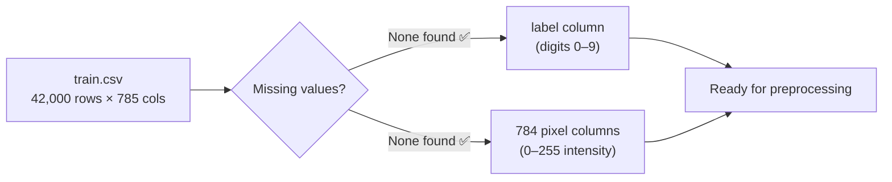
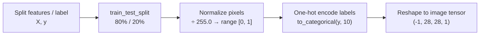
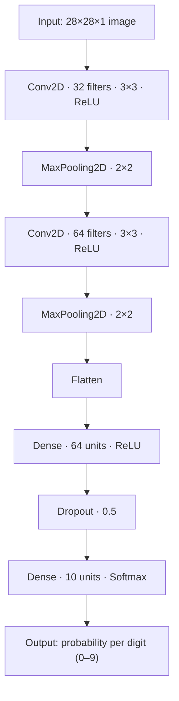
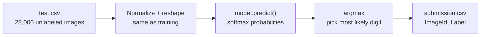

<div align="center">


<a href="https://github.com/Pranamchand">
  
</a>

<br/>


<br/>


</div>

<br/>

## 🎯 Goal

Given a **28×28 grayscale image** of a handwritten digit — flattened into 784 pixel columns — predict which digit it represents, **0 through 9**. This is the classic entry point into computer vision, based on the [Kaggle "Digit Recognizer"](https://www.kaggle.com/competitions/digit-recognizer) competition (a Kaggle-hosted version of the legendary **MNIST** dataset).

<div align="center">

<br/>
<sub><i>Illustrative example of handwritten digit variety (0–9) — the kind of shapes the model learns to tell apart.</i></sub>
</div>

<br/>

## 📑 Table of Contents

1. [Dataset](#-1-dataset)
2. [Environment & Imports](#-2-environment--imports)
3. [Exploratory Data Analysis](#-3-exploratory-data-analysis)
4. [Preprocessing](#-4-preprocessing)
5. [CNN Architecture](#-5-cnn-architecture)
6. [Training](#-6-training)
7. [Evaluation](#-7-evaluation)
8. [Inference & Submission](#-8-inference--submission)
9. [Key Takeaways](#-9-key-takeaways)


<br/>

## 📦 1. Dataset

Data is pulled directly from Kaggle using `kagglehub`, so the notebook runs end-to-end with zero manual file uploads.

```python
import kagglehub
digit_recognizer_path = kagglehub.competition_download('digit-recognizer')
```

| File | Rows | Columns | Description |
|:--|:-:|:-:|:--|
| `train.csv` | 42,000 | 785 | `label` (0–9) + 784 pixel intensity columns |
| `test.csv` | 28,000 | 784 | Same pixel columns, no label — this is what gets predicted |

Each row is one image, unrolled from a 28×28 grid into a flat vector of 784 values (`pixel0` … `pixel783`), each ranging from **0 (black)** to **255 (white)**.

<br/>

## ⚙️ 2. Environment & Imports

```python
import pandas as pd
import numpy as np
import matplotlib.pyplot as plt
import seaborn as sns

from sklearn.model_selection import train_test_split

import tensorflow as tf
from tensorflow.keras.models import Sequential
from tensorflow.keras.layers import Dense, Conv2D, Flatten, MaxPooling2D, Dropout
from tensorflow.keras.utils import to_categorical
```

The stack is deliberately lean: **pandas/NumPy** for data handling, **scikit-learn** for the split, and **TensorFlow/Keras** for the actual CNN.

<br/>

## 🔍 3. Exploratory Data Analysis

Before touching the model, a quick sanity pass confirms the data is clean and shaped as expected:

```python
df.isna().sum()      # → 0 missing values across all 785 columns
df.info()            # → all int64, 42,000 entries, 251.5 MB in memory
print(df.shape, df_test.shape)   # → (42000, 785) (28000, 784)
```



**Finding:** the dataset is already clean — no imputation, no dtype fixes, no dropped columns needed. That means more time can go straight into modeling.

<br/>

## 🧪 4. Preprocessing

Four transformations turn raw pixel rows into CNN-ready image tensors:



```python
X = df.drop('label', axis=1)
y = df['label']

X_train, X_test, y_train, y_test = train_test_split(X, y, test_size=0.2, random_state=42)

X_train = X_train.astype('float32') / 255.0      # Scaling
X_test  = X_test.astype('float32') / 255.0

y_train = to_categorical(y_train, num_classes=10)  # One-hot encoding
y_test  = to_categorical(y_test, num_classes=10)

X_train_cnn = X_train.values.reshape(-1, 28, 28, 1)   # 1 = single grayscale channel
X_test_cnn  = X_test.values.reshape(-1, 28, 28, 1)
```

**Why each step matters:**
- **Normalization (÷255):** keeps pixel values small and consistent, which helps the network converge faster and more stably.
- **One-hot encoding:** turns a single label like `7` into a 10-length vector (`[0,0,0,0,0,0,0,1,0,0]`) so it can be compared directly against the model's 10-way softmax output.
- **Reshaping:** a CNN needs spatial structure (`height × width × channels`), not a flat list of 784 numbers — this step restores the 2D image the network actually "sees."

<br/>

## 🧠 5. CNN Architecture



```python
model = Sequential([
    Conv2D(filters=32, kernel_size=(3, 3), activation='relu', input_shape=(28, 28, 1)),
    MaxPooling2D((2, 2)),
    Conv2D(filters=64, kernel_size=(3, 3), activation='relu'),
    MaxPooling2D((2, 2)),
    Flatten(),
    Dense(64, activation='relu'),
    Dropout(0.5),
    Dense(10, activation='softmax')
])

model.compile(optimizer='adam', loss='categorical_crossentropy', metrics=['accuracy'])
```

**Layer-by-layer intuition:**
| Layer | Role |
|:--|:--|
| `Conv2D(32)` | Learns simple local patterns — edges, curves, strokes |
| `MaxPooling2D` | Shrinks the image, keeping only the strongest signals (cheaper + more robust) |
| `Conv2D(64)` | Combines earlier patterns into higher-level shapes (loops, corners, digit parts) |
| `MaxPooling2D` | Downsamples again before flattening |
| `Flatten` | Converts the final feature maps into one long vector |
| `Dense(64)` | Learns how combinations of shapes map to digits |
| `Dropout(0.5)` | Randomly disables half the neurons each step — prevents overfitting |
| `Dense(10, softmax)` | Outputs a probability distribution across the 10 digit classes |

<br/>

## 🏋️ 6. Training

```python
history = model.fit(
    X_train_cnn, y_train,
    epochs=5, batch_size=64,
    validation_data=(X_test_cnn, y_test),
    verbose=1
)
```

<div align="center">

</div>

| Epoch | Train Acc | Train Loss | Val Acc | Val Loss |
|:-:|:-:|:-:|:-:|:-:|
| 1 | 85.40% | 0.4595 | 97.36% | 0.0884 |
| 2 | 94.96% | 0.1644 | 97.99% | 0.0638 |
| 3 | 96.41% | 0.1185 | 98.48% | 0.0502 |
| 4 | 96.97% | 0.1014 | 98.61% | 0.0479 |
| 5 | **97.51%** | **0.0840** | **98.60%** | **0.0410** |

Validation accuracy jumps to **97%+ after just one epoch** — a strong sign the CNN's convolutional filters are quickly picking up on stroke patterns — then climbs steadily as the network fine-tunes.

<br/>

## 📊 7. Evaluation

```python
acc = model.evaluate(X_test_cnn, y_test, verbose=0)
print('Test Accuracy: %.3f' % acc[1])
```

```
Test Accuracy: 0.986
```

<div align="center">

</div>

With only **5 epochs** and a fairly compact architecture, the model correctly classifies **~986 out of every 1,000** held-out digits — a strong baseline result for a first CNN pass.

<br/>

## 🚀 8. Inference & Submission

```python
df_test = df_test.astype('float32') / 255.0
df_test = df_test.values.reshape(-1, 28, 28, 1)

predictions = model.predict(df_test)
predicted_labels = np.argmax(predictions, axis=1)   # probabilities → class label (0–9)

submission = pd.DataFrame({
    'ImageId': range(1, len(predicted_labels) + 1),
    'Label': predicted_labels
})
submission.to_csv('submission.csv', index=False)
```



| ImageId | Label |
|:-:|:-:|
| 1 | 2 |
| 2 | 0 |
| 3 | 9 |
| 4 | 9 |
| 5 | 3 |

<br/>

## 🔑 9. Key Takeaways

- ✅ A clean dataset (no missing values) meant modeling time could go straight into architecture and tuning instead of cleanup.
- ✅ Normalizing pixels and reshaping into `(28, 28, 1)` tensors was essential — CNNs need spatial structure, not flat vectors.
- ✅ Two convolution + pooling blocks were enough to hit **98.6% accuracy** in just 5 epochs — a strong signal that deeper architectures, data augmentation, or more epochs could push this even higher.
- 🔜 **Next steps to explore:** data augmentation (rotation/shift), batch normalization, learning-rate scheduling, and a deeper CNN (e.g. 3 conv blocks) to close the remaining ~1.4% error gap.

<br/>

<div align="center">

*"Every good vision model starts by asking: does this even need a neural net? For 98.6% accuracy on handwritten digits — yes, it does."* 🔢


</div>